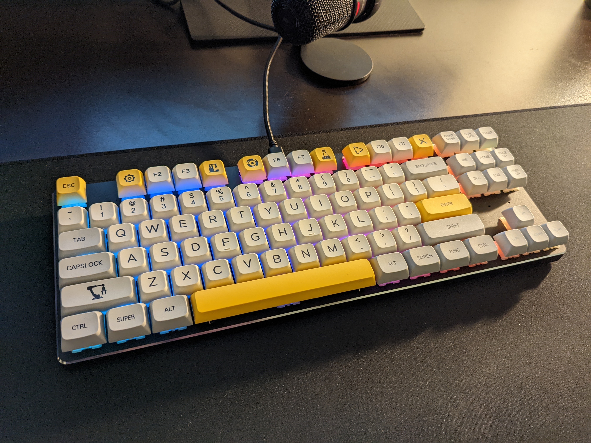
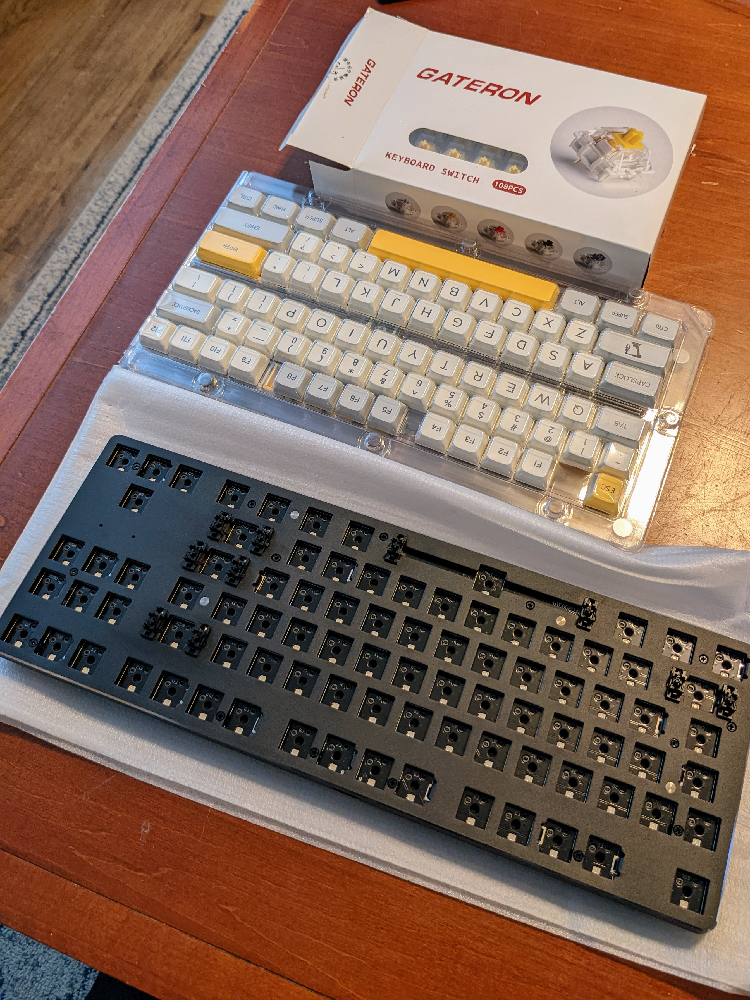
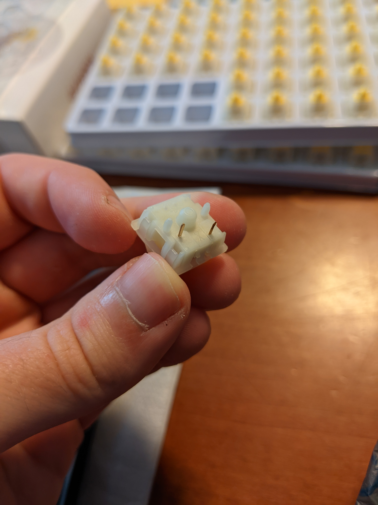
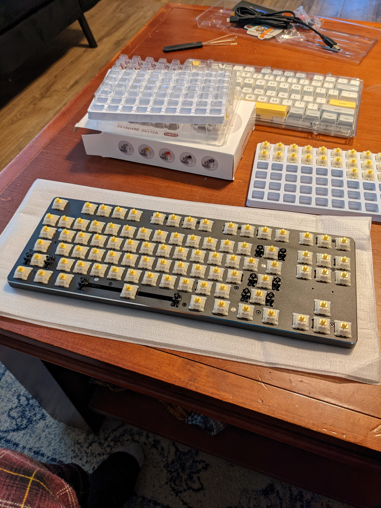
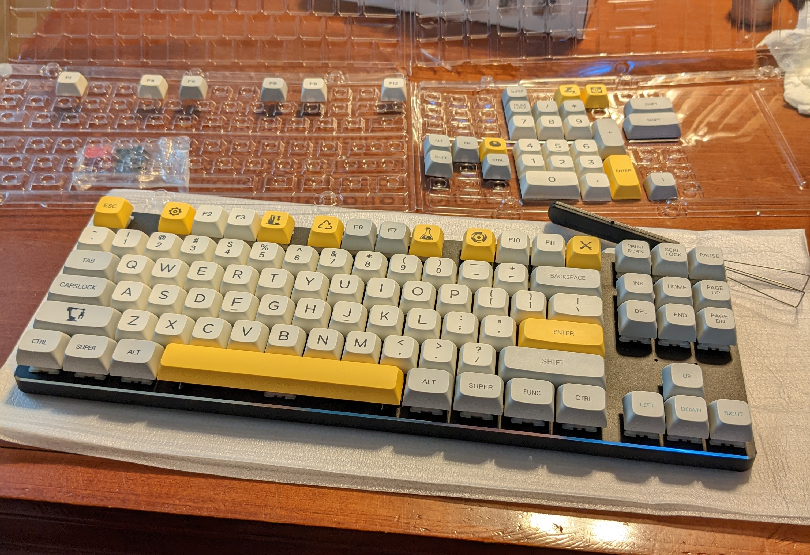

## Keyboards, keyboards, keyboards

I love keyboards. As a hobby, as a peripheral and as a history and culture, these things
are all really cool to me. There is just something magic about having an input device
with so many buttons, configurations and arrangements.
So many different typing experiences and ways to customize as well.

I have been wanting to get back into linear switches, as I have almost exclusively used
tactile for the last couple years and have been really wanting to get switches that are
both lighter quieter.

Also going on [/r/mechanicalkeyboards](https://www.reddit.com/r/MechanicalKeyboards/)
and seeing all the crazy builds that people make. It inspired me to do the same.

So I did... on a budget of roughly $100 USD.

Here is the final product:

with all the RGB goodness.

## The Components

Let's first talk about components.

I did buy all the components off of Amazon unfortunately (because budget), but here is what I got:

1. The base is a [GMMK 85% TKL](https://www.amazon.com/dp/B01MSVHZTT?psc=1&ref=ppx_yo2ov_dt_b_product_details)
2. The key switches are [Gateron Milky Yellows](https://www.amazon.com/dp/B09PH9MSFV?psc=1&ref=ppx_yo2ov_dt_b_product_details)
3. The keycap set is [XDK Custom PBT Keycaps (Heavy Industry)](https://www.amazon.com/dp/B0B5HVNR1K?psc=1&ref=ppx_yo2ov_dt_b_product_details)

The base was $49.22, the switches were $28.40, and the keycaps were $26.39. Coming together for a total of $104.01 (before taxes).

## Assembling

Starting out, the base comes with everything already preassembled, so there is nothing that needed to be done there.

The keyswitches did have to be installed into the base, but that is a relatively easy task.
You simply have to line up the switch and push the two metal pins inside the holes on the PCB.

But because these are gateron switches, they have two extra plastic pins on either side, so these
all had to be clipped off.

I did this while watching two episodes of Bob's Burgers, so I took around an hour
to clip all of them and put them in the board.

Finally, putting the keycaps on the switches is the last and final step to having
a custom keyboard.
Here's what it looks like with caps on:

## Typing

Finally, this post wouldn't be complete with a video showing what this keyboard sounds like...



Personally, I am pretty happy with the result.

I would seriously recommend doing this if you're thinking about picking up
a mechanical keyboard this holiday season (or anytime really).

Thanks for reading! :heart:
