This is an update post for the Mini PC build promised earlier in
[this post](/posts/pc-homelab-update-03-2025/#pc-upgrade)

I have had some question on "why" so I thought I would give some of the motivation
for the Mini ITX form factor and it really boils to this:

## Motivations

1. I have always wanted to build a smaller form factor PC.
1. I have never needed to use all the ports on my previous gaming PC builds.
1. More lightweight and portable. It fits on my desk better.
1. The price/performance was right (at least for the mobo/cpu)

## Sourcing Parts (Shopping)

I ordered almost all the parts for this build off of Amazon. There are not any
good PC part retailers around my area and most of the things that I bought
had some kind of sale - which doesn't really amount to much savings these days.

I would have liked to go visit a Microcenter, but that will be for another build
and another time.

## The Build

| Component | Desc                                                                                                                      |
| --------- | ------------------------------------------------------------------------------------------------------------------------- |
| MOBO      | [MINISFORUM Motherboard BD795i SE](https://www.amazon.com/dp/B0DBHTBQCS?ref=ppx_yo2ov_dt_b_fed_asin_title)                |
| CPU       | [AMD Ryzen 9 7945HX (integrated)](https://www.amazon.com/dp/B0DBHTBQCS?ref=ppx_yo2ov_dt_b_fed_asin_title)                 |
| RAM       | [Crucial RAM 32GB Kit (2x16GB) DDR5 5600MHz](https://www.amazon.com/dp/B0BLTDRRLF?ref=ppx_yo2ov_dt_b_fed_asin_title&th=1) |
| SSD       | [WD_BLACK 2TB SN7100 M.2 NVMe](https://www.amazon.com/dp/B0DN6ZQ3PD?ref=ppx_yo2ov_dt_b_fed_asin_title)                    |
| GPU       | [XFX Swift AMD Radeon RX 9070](https://www.amazon.com/dp/B0DW4GPX5Q?ref=ppx_yo2ov_dt_b_fed_asin_title)                    |
| PSU       | [NZXT C850 Gold ATX 3.1 850w](https://www.amazon.com/dp/B0D1VDTX8B?ref=ppx_yo2ov_dt_b_fed_asin_title&th=1)                |
| FAN (CPU) | [Noctua NF-P12](https://www.amazon.com/dp/B07CG2PGY6?ref=ppx_yo2ov_dt_b_fed_asin_title)                                   |
| CASE      | [Lian Li A3-mATX Black](https://www.amazon.com/dp/B0D5GYY364?ref=ppx_yo2ov_dt_b_fed_asin_title)                           |

## The Pics

I had taken some pics of the build process below

### Mobo

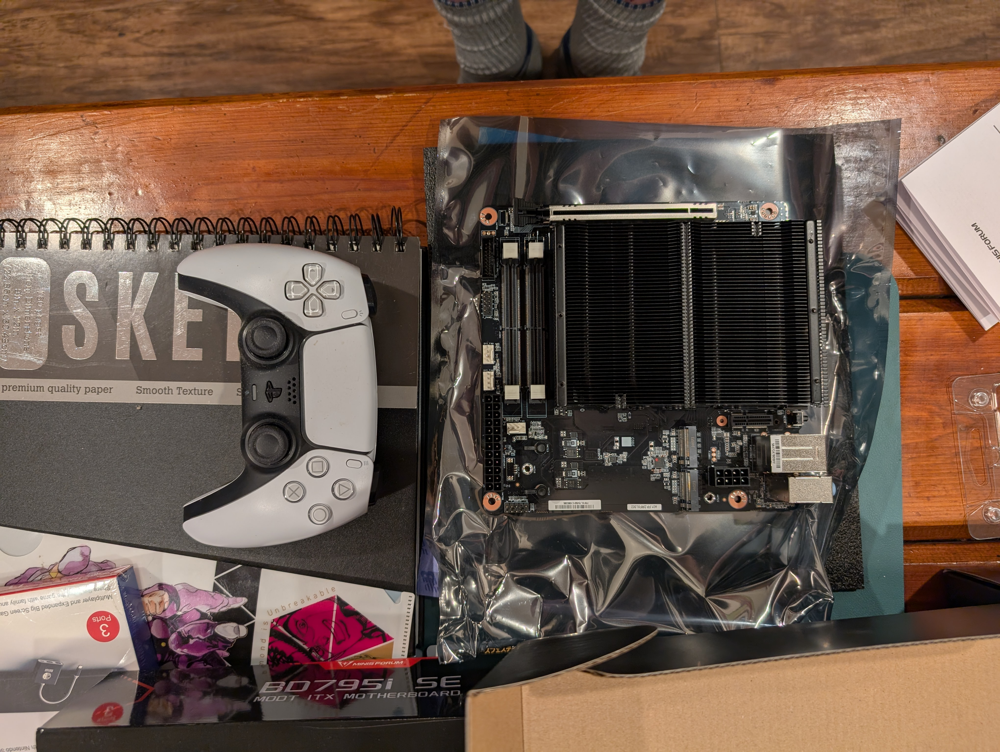
_The mobo size with a PS5 controller for reference_

---

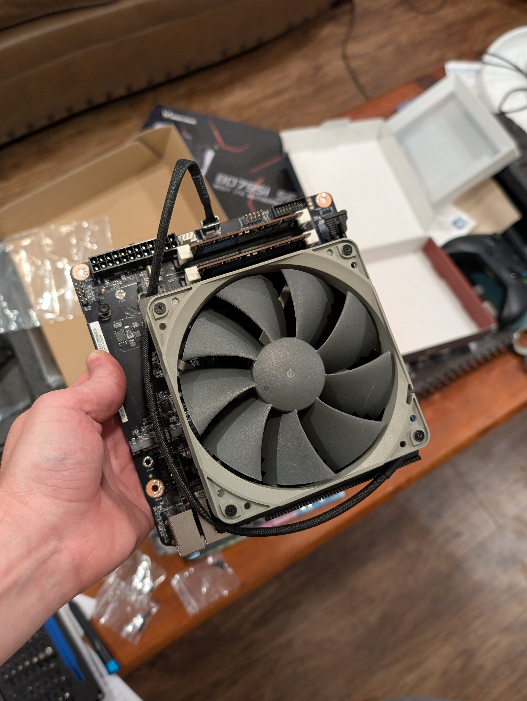
_Mounted the fan and installed SO-DIMMs_

#### User Error

I actually did a oopsie here by hooking the CPU fan up to the system fan header
on the mobo. This caused some confusion later as to why my CPU fan was not ramping
up and temps were getting up to 80-90 deg c at idle.
I fixed very shortly after seeing that.

CPU temps still get up to that level under load, but now idle is way cooler sitting
around 50-70 deg c. range.

I swear this has never happened before _LMAO_.

Also the orientation of the fan is fine either way as far as I can tell. One
thing to consider is if you have a case with a glass side panel, the air may not
have an easy time escaping if exhaust side is inches away from a glass wall.

### M.2 NVME Drive

After this, I was waiting on the M.2 drive to show up... and it did!

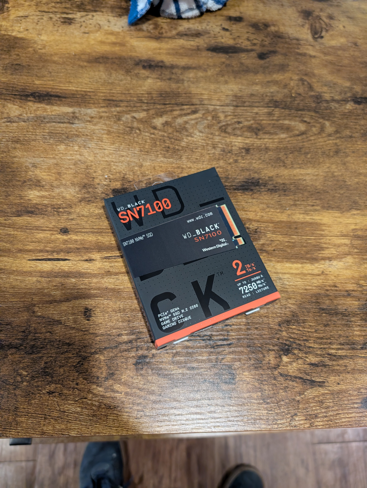
_Installed in the M.2 slot and was set._

### Case

Then it was time to get started on installing the power supply in the case:

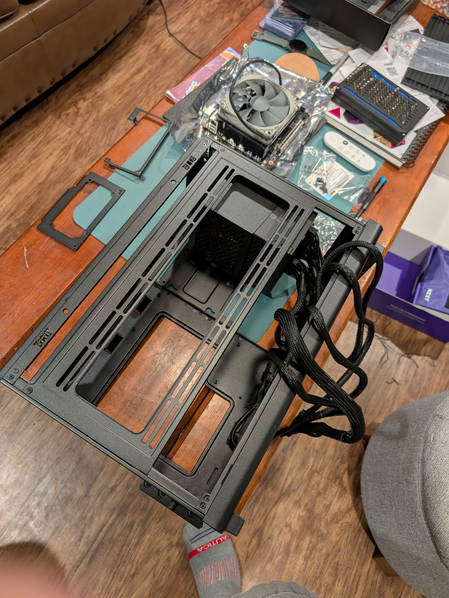
_the dangling cables of the power supply_

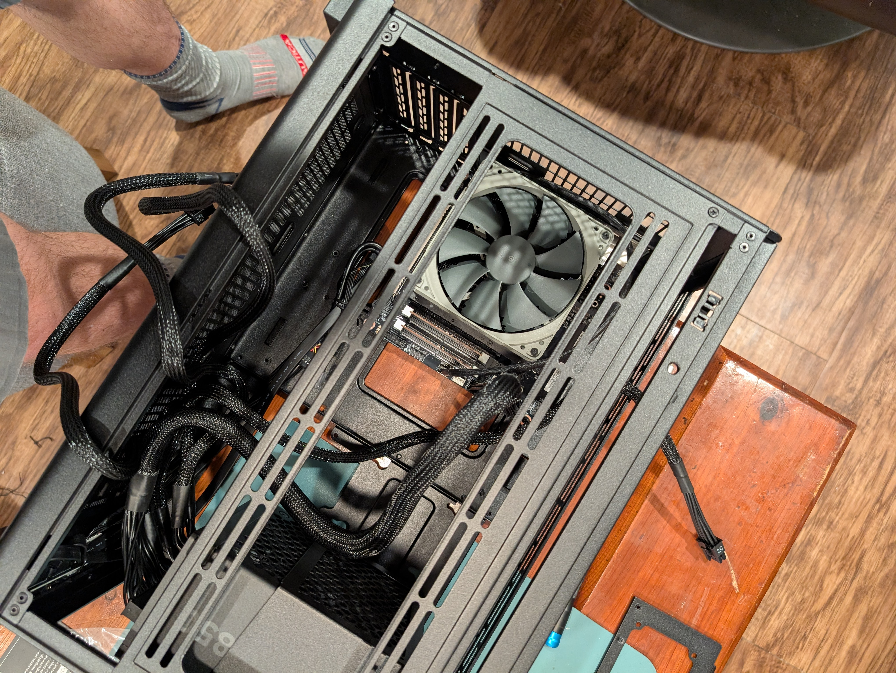
_Mounted the mobo in the case_

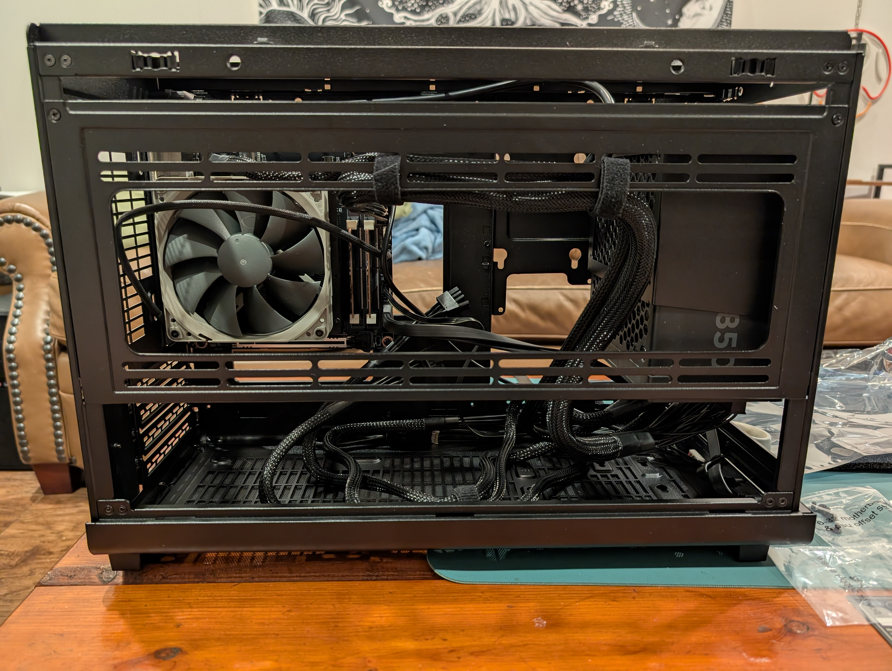
_And somewhat cable managed_

I was still waiting on the GPU to come in the mail.
so I slapped all the panels back on and just verified that it booted up
and worked with Ubuntu and then eagerly waited for my 9070.

### GPU

GPU came in the mail, the box was the same size as the case.

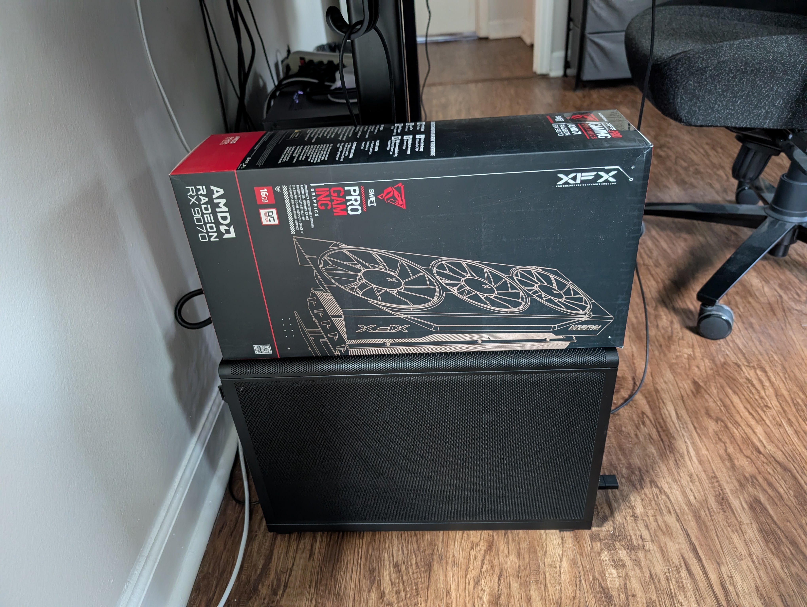
_I should have just used the GPU box as a case_

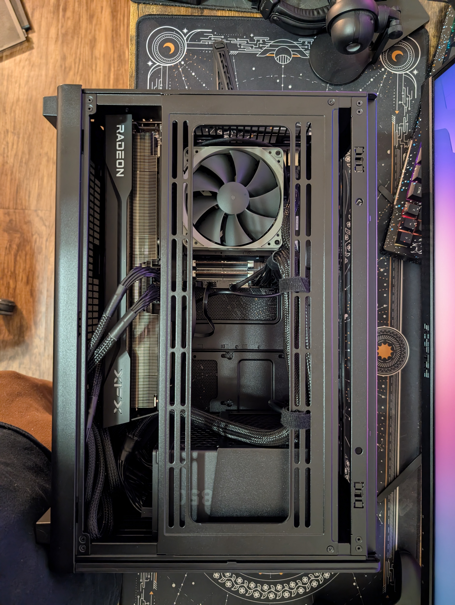
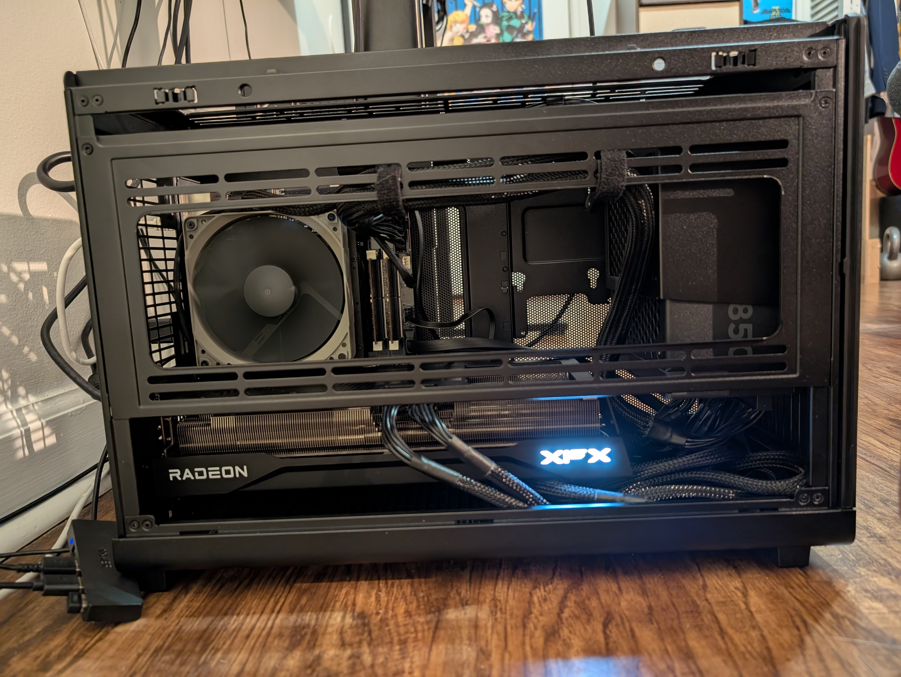
_All put together_

---

And that's pretty much the whole build. I tried Ubuntu on a USB drive and
it seemed to work fine and load all the GPU drivers.

### Software

I did end up installing Windows 11 (I know I know) because I wanted to test
it out. This is the first PC that I've had with a TPM chip where I actually
had the opportunity to legitimately install Windows 11.

More than likely I will switch over to Arch Linux at some point in the near
future to see how it does on this hardware, but until then Windows/WSL works
and has been pretty stable:

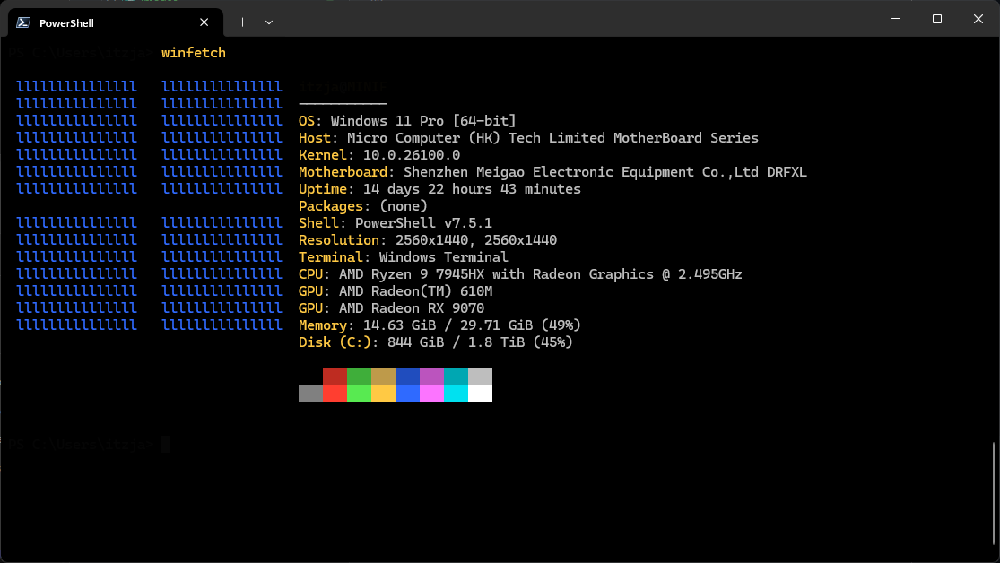

Until next time!

### Bonus

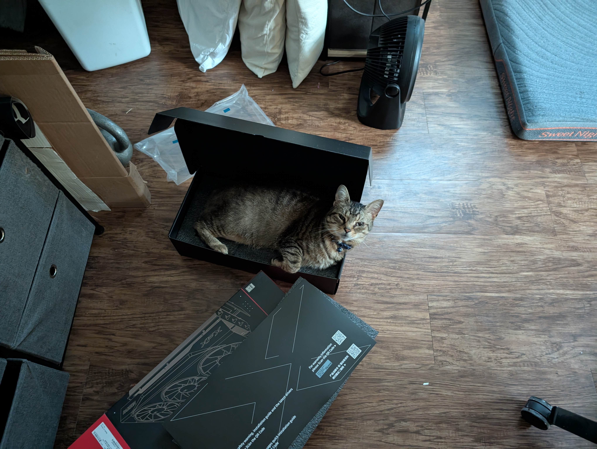
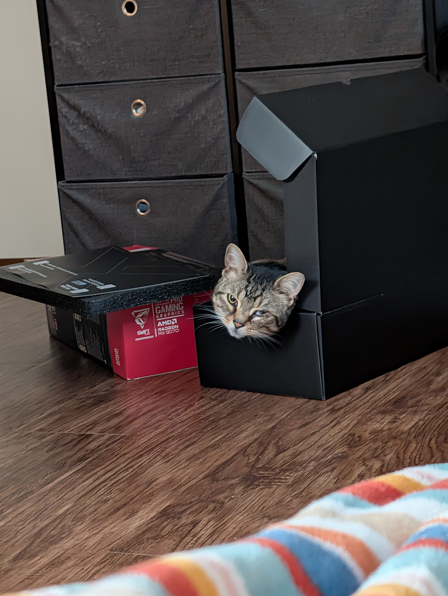
_Rockette decided the GPU box was her new bed_
